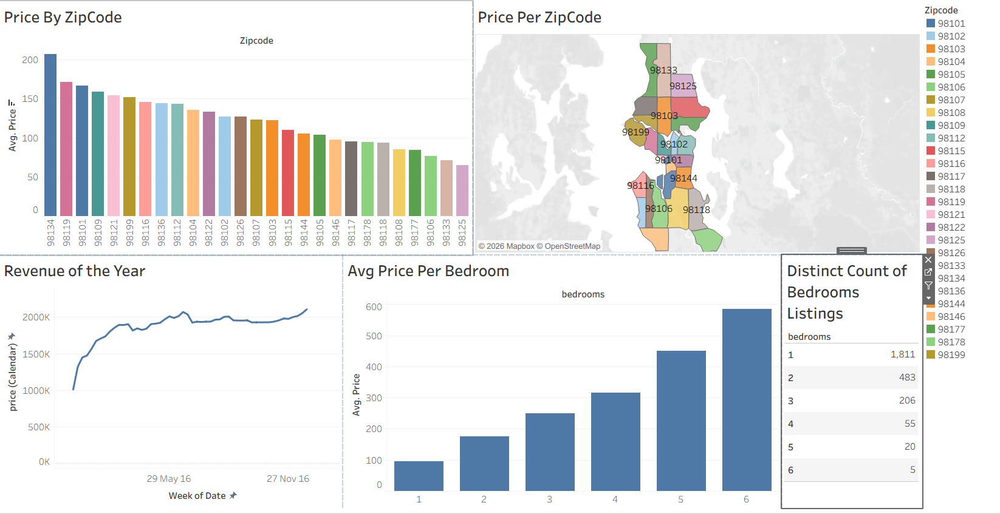

# Airbnb Data Analysis – Tableau Dashboard

## Project Overview

This project is an interactive Tableau dashboard created to analyze Airbnb listing data. The dashboard provides insights into property prices, revenue trends, bedroom-wise pricing, and the distribution of listings across different ZIP codes.

## Dashboard Analysis

The dashboard includes the following visualizations:

- **Price by ZIP Code** – Compares the average Airbnb price across different ZIP codes.
- **Price per ZIP Code Map** – Shows the geographic distribution of average Airbnb prices by ZIP code.
- **Revenue of the Year** – Displays the revenue trend over time.
- **Average Price per Bedroom** – Analyzes the relationship between the number of bedrooms and average listing price.
- **Distinct Count of Bedroom Listings** – Shows the number of listings available for each bedroom category.

## Key Insights

- Airbnb prices vary significantly across different ZIP codes.
- The dashboard provides a geographical view of pricing differences.
- Average price generally increases as the number of bedrooms increases.
- Most listings are concentrated in properties with fewer bedrooms.
- Revenue trends can be analyzed over the year to understand business performance.

## Tools Used

- Tableau
- Data Analysis
- Data Visualization
- Interactive Dashboard
- Maps
- Charts and Graphs

## Skills Demonstrated

- Tableau Dashboard Development
- Data Visualization
- Data Analysis
- Geographic Analysis
- KPI and Trend Analysis
- Business Insights

## Project Objective

The objective of this project is to transform Airbnb listing data into meaningful visual insights using Tableau and create an interactive dashboard that helps understand pricing, revenue, location, and bedroom-wise listing patterns.

## Dashboard Preview

